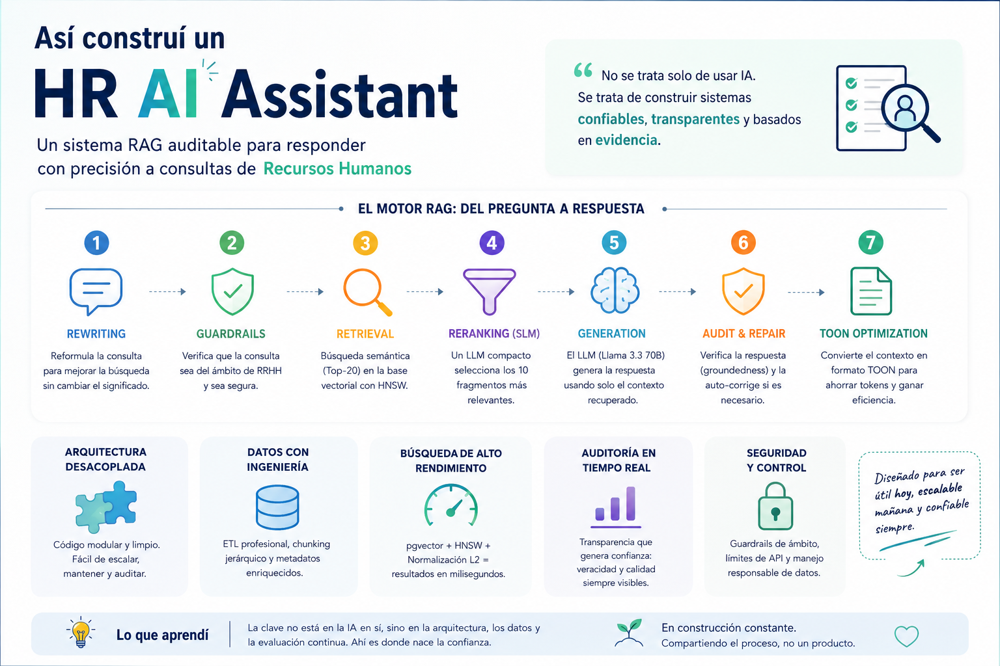

# HR AI Assistant (RAG + Audit Architecture) 🤖💼



> **Enterprise-grade RAG system for HR Knowledge Management.**
>
> 🌐 **Live Demo:** [https://melzarate-science-hr-ai-assistant-appui-cmkixp.streamlit.app/](https://melzarate-science-hr-ai-assistant-appui-cmkixp.streamlit.app/)

>
> Este proyecto es un asistente de Recursos Humanos diseñado bajo una arquitectura desacoplada y auditable. Utiliza técnicas de **Generación Aumentada por Recuperación (RAG)** de nivel profesional con ciclos de validación automática.

---

## 🏗️ Arquitectura del Sistema (Deep Dive)

### 1. Ingesta y Estrategia de Datos (ETL)
*   **Hierarchical Markdown Extraction:** Transformamos PDFs en Markdown para inyectar jerarquía estructural. Usamos `MarkdownHeaderTextSplitter` para mantener la relación entre títulos y contenido.
*   **Chunking Metodológico:** Tamaño de fragmento de **1500 caracteres** para preservar la integridad de las reglas de RRHH, con enriquecimiento de metadatos en el prefijo.

### 2. Capa de Datos e Infraestructura
*   **Connection Pooling:** Gestión profesional de conexiones a Neon mediante `psycopg2.pool.ThreadedConnectionPool` para alta concurrencia y baja latencia.
*   **Normalización L2:** Pre-procesamiento de vectores para optimizar la búsqueda semántica.
*   **HNSW Index:** Indexación vectorial ultra rápida usando Producto Punto (`vector_ip_ops`) en Neon.

### 3. El Motor RAG (Orquestación)
El sistema utiliza un **Orquestador Centralizado** que desacopla la lógica de negocio del framework web:
1.  **Rewriting:** Reformulación neutral de consultas para búsqueda vectorial.
2.  **Guardrails:** Validación de ámbito (RRHH-only) y seguridad.
3.  **Retrieval:** Recuperación de alta fidelidad con búsqueda inicial Top-20.
4.  **Reranking:** Uso de **SLM (Llama 8B)** para seleccionar los 10 mejores fragmentos.
5.  **Generation:** Motor de IA (Groq Llama 3.3 70B) con prompts externalizados.
6.  **Audit & Repair:** Ciclo automático de veracidad y auto-corrección sin meta-texto.
7.  **TOON Optimization:** Serialización compacta del contexto para ahorro de tokens.

---

## 🛠️ Tech Stack & Herramientas

*   **LLM Engine:** Groq (Llama 3.3 70B / Llama 3.1 8B).
*   **Vector Database:** Neon (PostgreSQL + pgvector + HNSW).
*   **API Framework:** FastAPI (Estructura de servicios desacoplados).
*   **UI Framework:** Streamlit (Panel de control con métricas de auditoría).
*   **Embeddings:** Sentence-Transformers (`paraphrase-multilingual-MiniLM-L12-v2`).

---

## 📂 Estructura del Proyecto (Enterprise Refactored)

```text
├── app/
│   ├── main.py         # Entry point (FastAPI Controllers)
│   └── ui.py           # Frontend (Streamlit)
├── core/
│   ├── database.py     # Connection Pooling Manager
│   ├── orchestrator.py # RAG Pipeline Orchestrator
│   ├── retriever.py    # Vector Search & SQL logic
│   ├── reranker.py     # SLM Reranking logic
│   ├── llm.py          # LLM Interface
│   ├── guardrails.py   # Safety & Scope Manager
│   └── repair.py       # Self-healing logic
├── prompts/            # Centralized Prompts (.txt files)
├── evaluation/
│   └── eval_runner.py  # Groundedness & Grading Audit
└── scripts/            # ETL & Indexing tools
```

---

## 📊 Capa de Auditoría y Evaluación
El asistente incluye un panel lateral que muestra en tiempo real:
- **Groundedness Score:** Veracidad basada en evidencia documental.
- **Calidad (Grading):** Relevancia, Claridad y Utilidad (1-5).
- **Telemetría:** Desglose de pasos del pipeline y consumo de tokens.

---

## 💡 Nota Metodológica
Este proyecto ha sido refactorizado siguiendo estándares de ingeniería de software de alto nivel: **Separación de Responsabilidades (SoC)**, **Patrones de Diseño (Singleton, Repository)** y **Optimización de Recursos (Connection Pooling)**. Es una solución diseñada para ser escalable, transparente y fácil de mantener.

---
*Desarrollado como una solución de IA confiable, transparente y auditable para entornos corporativos de alta demanda.*
