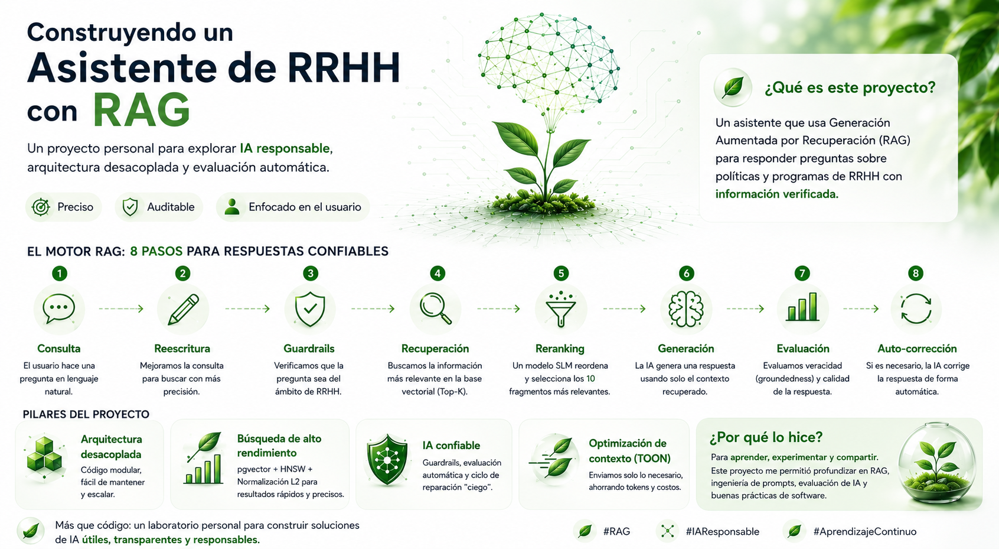

# HR AI Assistant (RAG + Audit Architecture) 🤖💼



> **Enterprise-grade RAG system for HR Knowledge Management.**
>
> 🌐 **Live Demo:** [https://melzarate-science-hr-ai-assistant-appui-cmkixp.streamlit.app/](https://melzarate-science-hr-ai-assistant-appui-cmkixp.streamlit.app/)
> *(El demo se duerme por inactividad: si ves "Zzzz", tocá el botón para despertarlo y esperá unos 3 minutos.)*

>
> Este proyecto es un asistente de Recursos Humanos diseñado bajo una arquitectura desacoplada y auditable. Utiliza técnicas de **Generación Aumentada por Recuperación (RAG)** de nivel profesional con ciclos de validación automática.

---

## 🏗️ Arquitectura del Sistema (Deep Dive)

### 1. Ingesta y Estrategia de Datos (ETL)
*   **Hierarchical Markdown Extraction:** Transformamos PDFs en Markdown para inyectar jerarquía estructural. Usamos `MarkdownHeaderTextSplitter` para mantener la relación entre títulos y contenido.
*   **Chunking Metodológico:** Tamaño de fragmento de **600 caracteres** para preservar la integridad y densidad semántica de las reglas de RRHH, con enriquecimiento de metadatos en el prefijo.

### 2. Capa de Datos e Infraestructura
*   **Connection Pooling:** Gestión profesional de conexiones a Neon mediante `psycopg2.pool.ThreadedConnectionPool` para alta concurrencia y baja latencia.
*   **Normalización L2:** Pre-procesamiento de vectores para optimizar la búsqueda semántica.
*   **HNSW Index:** Indexación vectorial ultra rápida usando Producto Punto (`vector_ip_ops`) en Neon (equivalente a Similitud Coseno gracias a la normalización). Umbral de similitud de **0.20**.

### 3. El Motor RAG (Orquestación)
El sistema utiliza un **Orquestador Centralizado** que desacopla la lógica de negocio del framework web:
1.  **Rewriting:** Reformulación neutral de consultas para búsqueda vectorial usando modelos ultra-rápidos (Gemini 2.5 Flash).
2.  **Guardrails:** Validación de ámbito (RRHH-only) y seguridad.
3.  **Retrieval:** Búsqueda vectorial inicial de hasta **40 candidatos** sobre el índice de pgvector.
4.  **Reranking:** Gemini 2.5 Flash selecciona hasta **10 fragmentos** que contestan específicamente la pregunta, y puede devolver una lista vacía si ninguno lo hace. De eso depende que el asistente se abstenga en vez de responder con información de otro tema.
5.  **Generation:** **Gemini 2.5 Flash** con prompts externalizados. Pro resultó demasiado lento para una respuesta conversacional.
6.  **Audit & Repair (Self-Healing):** Verificación automática de veracidad (Groundedness) con Gemini 2.5 Flash como juez y, si falla, reparación de la respuesta con Gemini 2.5 Pro.
7.  **TOON:** Serialización compacta del contexto (`fuente|contenido`) con un tope de 8.000 caracteres. El ahorro de tokens frente a otros formatos no se midió.

---

## 📊 Evaluación

El pipeline se mide contra un **golden set de 35 preguntas** (`evaluation/golden_set.jsonl`): 14 factuales, 6 de agregación, 5 condicionales según el perfil del empleado, 5 sin respuesta en los documentos (donde lo correcto es abstenerse), 3 fuera de ámbito y 2 conversacionales. Cada pregunta tiene su comportamiento esperado, sus hechos clave y los fragmentos que la responden.

La evaluación está separada en dos capas que se calibran en orden ([metodología](EVALUATION_METHODOLOGY.md)):

- **Capa 1 — Retrieval:** ¿le llega al modelo el contexto correcto?
- **Capa 2 — Generación:** ¿la respuesta está respaldada por los documentos y hace lo que corresponde?

Cada corrida queda registrada en la [bitácora de experimentos](EXPERIMENTS.md), incluidas las regresiones, con su resultado crudo en `evaluation/runs/`.

### Resultados (Capa 2, 35 preguntas)

| Métrica | Baseline (Run 1) | Post-fix (Run 5) | Validación final (Run 8) |
|---|---|---|---|
| Comportamiento esperado (responder / abstenerse / bloquear) | 29/35 (83 %) | 34/35 (97 %) | 33/35 (94 %) |
| Fuente correcta citada | 100 % | 100 % | 100 % |
| Hechos clave presentes en la respuesta | 96 % | 94 % | 94 % |
| Groundedness (juez LLM, PASS) | 31/35 (89 %) | 32/35 (91 %) | 31/35 (89 %) |
| Latencia por respuesta (mediana) | 16,4 s | 14,2 s | 17,7 s |

La mejora vino del reranker, que pasó de elegir fragmentos "relacionados" a exigir que contesten la pregunta. Un primer ajuste de prompt había introducido una regresión, documentada en la bitácora junto con su diagnóstico. La diferencia entre el Run 5 y el Run 8 es no determinismo del reranker: aun con `temperature=0`, una pregunta falla de forma intermitente.

En la Capa 1, la búsqueda vectorial ubica el fragmento correcto con un MRR de 0,64, y después del reranking se conserva el 84,6 % de los fragmentos relevantes.

### Limitaciones conocidas

- **Corpus chico:** 3 documentos y 27 fragmentos. Con 40 candidatos, la búsqueda vectorial devuelve casi todo el corpus y el filtro real lo hace el reranker. A mayor escala, el diseño de esa etapa cambia.
- **Preguntas sin respuesta en los documentos:** es la categoría más débil (3/5 en el Run 8). Una falla es el no determinismo del reranker; la otra es una decisión de producto abierta: ante una pregunta por el saldo personal de vacaciones, ¿explicar la regla general o abstenerse?
- **El juez y el generador son el mismo modelo** (Gemini 2.5 Flash), lo que puede inflar el groundedness.
- **Las respuestas esperadas del golden set son un borrador** pendiente de revisión humana (campo `revisado_por_humano`).
- **La auditoría en línea suma latencia:** cuando se activa la reparación, la respuesta tarda entre 34 y 66 s.
- **La Precision post-rerank de la bitácora (85,6 %)** divide por la cantidad de fragmentos que devolvió el reranker y no por un k fijo, así que no es comparable con una Precision@10. Está pendiente de recalcular y no se usa en este resumen.

---

## 🛠️ Tech Stack & Herramientas

*   **LLM Engine:** Google Gemini: 2.5 Flash para rewriting, guardrail, reranking, generación y auditoría; 2.5 Pro solo para la reparación.
*   **Vector Database:** Neon (PostgreSQL + pgvector + HNSW).
*   **API Framework:** FastAPI (Estructura de servicios desacoplados).
*   **UI Framework:** Streamlit (Panel de control con métricas de auditoría).
*   **Embeddings:** Sentence-Transformers (`paraphrase-multilingual-MiniLM-L12-v2`).

---

## 📂 Estructura del Proyecto (Enterprise Refactored)

```text
├── app/
│   ├── main.py         # Entry point (FastAPI Controllers)
│   └── ui.py           # Frontend (Streamlit)
├── core/
│   ├── database.py     # Connection Pooling Manager
│   ├── orchestrator.py # RAG Pipeline Orchestrator
│   ├── retriever.py    # Vector Search & SQL logic
│   ├── reranker.py     # LLM Reranking logic
│   ├── llm.py          # LLM Interface (Tiered Models)
│   ├── guardrails.py   # Safety & Scope Manager
│   └── repair.py       # Self-healing logic
├── prompts/            # Centralized Prompts (.txt files)
├── evaluation/
│   ├── eval_runner.py          # Auditoría en línea: groundedness y grading
│   ├── golden_set.jsonl        # 35 preguntas etiquetadas
│   ├── run_golden_eval.py      # Evaluación end-to-end (Capa 2)
│   ├── run_retrieval_eval.py   # Evaluación de retrieval (Capa 1)
│   └── runs/                   # Resultado crudo de cada corrida
├── scripts/                    # ETL & Indexing tools
├── EVALUATION_METHODOLOGY.md   # Cómo se mide y en qué orden
└── EXPERIMENTS.md              # Bitácora de corridas
```

---

## 🖥️ Panel de auditoría en la interfaz
El asistente incluye un panel lateral que muestra en tiempo real:
- **Groundedness Score:** Veracidad basada en evidencia documental.
- **Calidad (Grading):** Relevancia, Claridad y Utilidad (1-5).
- **Telemetría:** Desglose de pasos del pipeline y consumo de tokens.

---

## 💡 Nota Metodológica
Este proyecto ha sido refactorizado siguiendo estándares de ingeniería de software de alto nivel: **Separación de Responsabilidades (SoC)**, **Patrones de Diseño (Singleton, Repository)**, **Optimización de Recursos (Connection Pooling)**, y un **Motor RAG Resiliente (Auto-Repair)**. Es una solución diseñada para ser transparente y auditable; sus limitaciones conocidas están documentadas en la sección de Evaluación.

---
*Desarrollado como una solución de IA confiable, transparente y auditable para entornos corporativos de alta demanda.*
